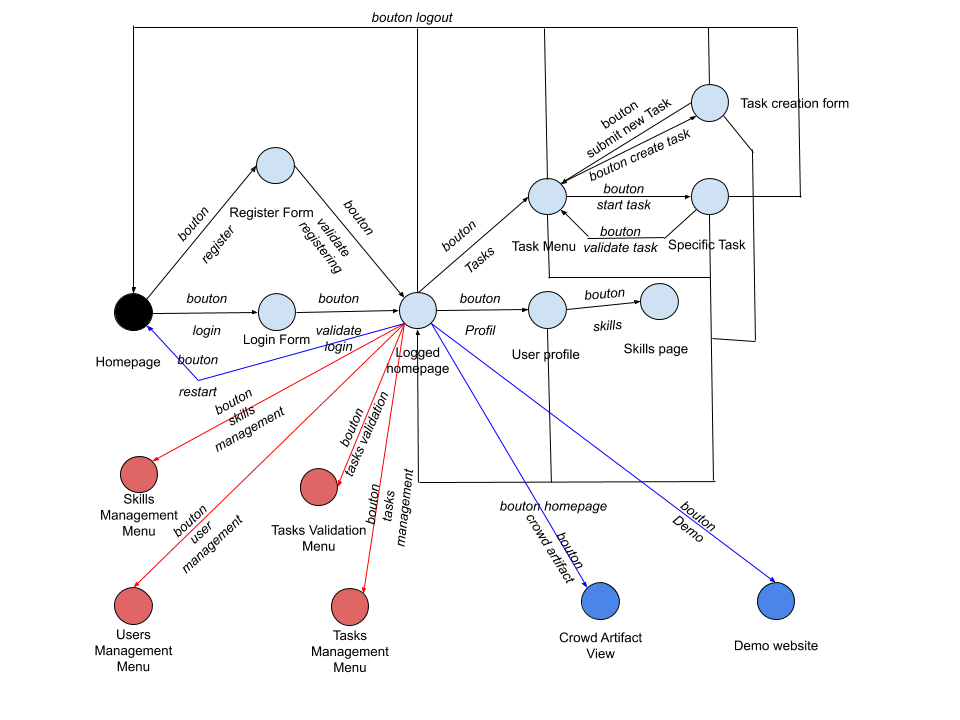

# Manuel de reprise de code

Le projet Headwork est un projet Angular, nécessitant une installation particulière détaillée ci-dessous.

## 1. Mise en place de l'environnement de travail
### 1.1. Récupération du projet sous Windows
Sur la [page GitHub du projet](https://github.com/Rhohen/HD12), cliquer sur "Clone or Download".

Télécharger l'archive et l'extraire dans le répertoire de votre choix.

### 1.2. Installation de Node.js sous Windows
Sur le [site de Node.js](https://nodejs.org/en/download/), télécharger "Windows installer" et suivre les instructions d'installation fournies.

Dans la console Windows, se positionner à la racine du projet.

Exécuter la commande `npm install -g @angular/cli`.

Si une erreur relative à la version des package apparaît, exécuter la commande `npm update`.

Pour plus de détails sur la mise en place d'un projet Angular tel que celui-ci, consulter le [tutoriel Angular](https://angular.io/guide/quickstart), très complet.

### 1.3. Lancement du serveur local
Exécuter, à la racine du projet, la commande `ng serve -o`.

Après quelques minutes, le serveur est lancé et le navigateur ouvre la page d'acceuil du site en local.

## 2. Organisation des fichiers du projet
Les fichiers sont organisés selon le diagramme suivant :

## 3. Fonctionnalités implémentées et à implémenter

  

---

Autres documents d'information :  
- [manuel d'utilisation](https://github.com/Rhohen/HD12/blob/master/Headwork2/document_fr/utilisation.md) ;
- [document post-mortem](https://github.com/Rhohen/HD12/blob/master/Headwork2/document_fr/post_mortem.md).
